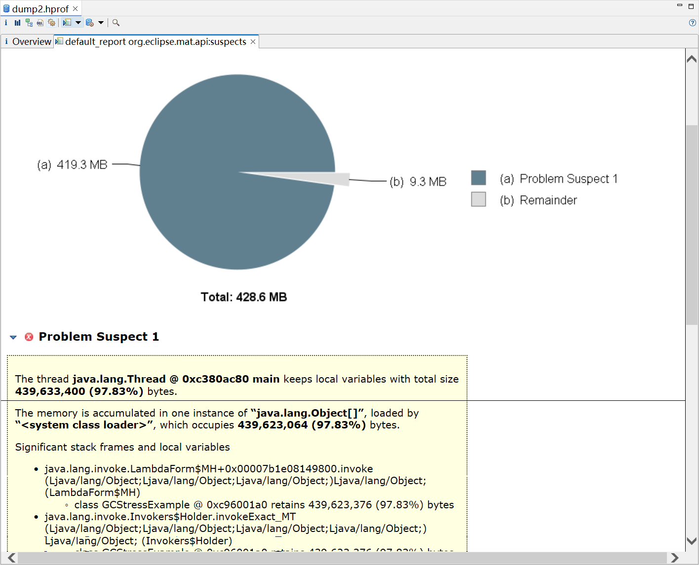
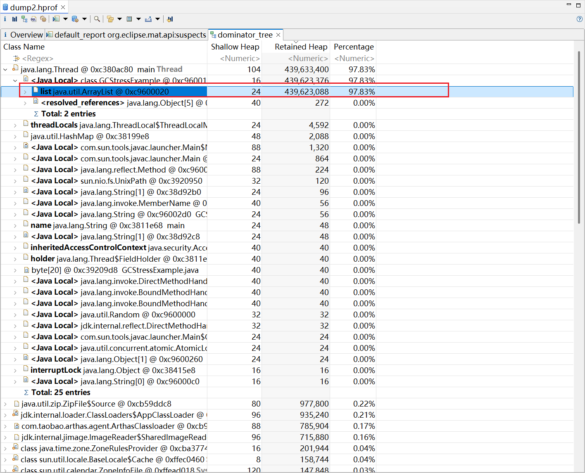
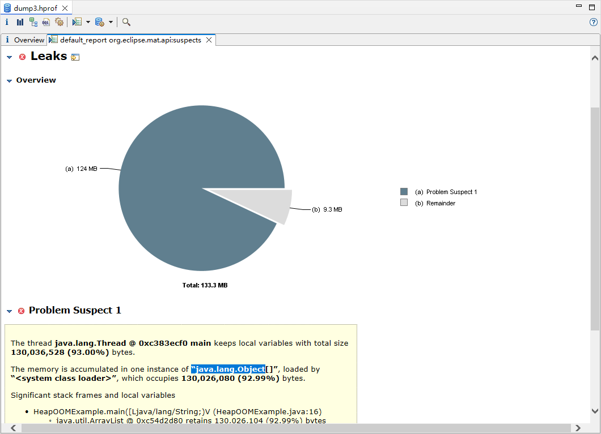
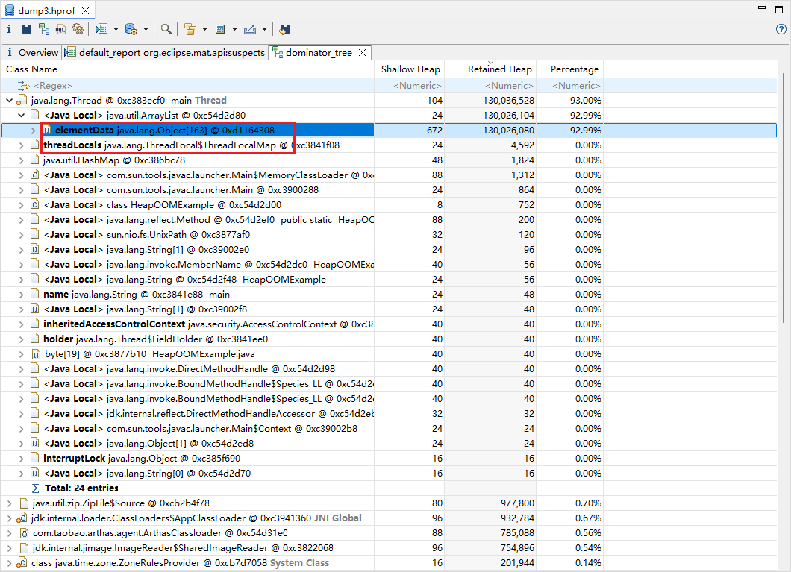

docker build -t jstat-jinfo-jcmd-troubleshooting .

# GC压力测试
docker run -it --name troubleshoot-java-gc jstat-jinfo-jcmd-troubleshooting /troubleshoot/stress_scripts/start_services.sh gc-stress


```
[arthas@3762]$ memory
Memory                                                                  used                    total                   max                     usage
heap                                                                    245M                    382M                    968M                    25.31%
g1_eden_space                                                           1M                      46M                     -1                      2.17%
g1_old_gen                                                              241M                    333M                    968M                    24.90%
g1_survivor_space                                                       3M                      3M                      -1                      100.00%
nonheap                                                                 41M                     44M                     -1                      93.13%
codeheap_'non-nmethods'                                                 1M                      2M                      5M                      30.58%
metaspace                                                               30M                     31M                     -1                      98.93%
codeheap_'profiled_nmethods'                                            4M                      4M                      117M                    3.84%
compressed_class_space                                                  3M                      3M                      1024M                   0.35%
codeheap_'non-profiled_nmethods'                                        952K                    2496K                   120036K                 0.79%
mapped                                                                  0K                      0K                      -                       0.00%
direct                                                                  4M                      4M                      -                       100.00%
mapped - 'non-volatile memory'                                          0K                      0K                      -                       0.00%
[arthas@3762]$ memory
Memory                                                                  used                    total                   max                     usage
heap                                                                    251M                    382M                    968M                    25.93%
g1_eden_space                                                           7M                      46M                     -1                      15.22%
g1_old_gen                                                              241M                    333M                    968M                    24.90%
g1_survivor_space                                                       3M                      3M                      -1                      100.00%
nonheap                                                                 41M                     44M                     -1                      93.21%
codeheap_'non-nmethods'                                                 1M                      2M                      5M                      30.58%
metaspace                                                               30M                     31M                     -1                      98.82%
codeheap_'profiled_nmethods'                                            4M                      4M                      117M                    3.89%
compressed_class_space                                                  3M                      3M                      1024M                   0.35%
codeheap_'non-profiled_nmethods'                                        957K                    2496K                   120036K                 0.80%
mapped                                                                  0K                      0K                      -                       0.00%
direct                                                                  4M                      4M                      -                       100.00%
mapped - 'non-volatile memory'                                          0K                      0K                      -                       0.00%
[arthas@3762]$ memory
Memory                                                                  used                    total                   max                     usage
heap                                                                    259M                    382M                    968M                    26.76%
g1_eden_space                                                           14M                     46M                     -1                      30.43%
g1_old_gen                                                              242M                    333M                    968M                    25.00%
g1_survivor_space                                                       3M                      3M                      -1                      100.00%
nonheap                                                                 41M                     44M                     -1                      93.33%
codeheap_'non-nmethods'                                                 1M                      2M                      5M                      30.58%
metaspace                                                               30M                     31M                     -1                      98.75%
codeheap_'profiled_nmethods'                                            4M                      4M                      117M                    3.95%
compressed_class_space                                                  3M                      3M                      1024M                   0.35%
codeheap_'non-profiled_nmethods'                                        961K                    2496K                   120036K                 0.80%
mapped                                                                  0K                      0K                      -                       0.00%
direct                                                                  4M                      4M                      -                       100.00%
mapped - 'non-volatile memory'                                          0K                      0K                      -                       0.00%
[arthas@3762]$ memory
Memory                                                                  used                    total                   max                     usage
heap                                                                    264M                    382M                    968M                    27.27%
g1_eden_space                                                           19M                     46M                     -1                      41.30%
g1_old_gen                                                              242M                    333M                    968M                    25.00%
g1_survivor_space                                                       3M                      3M                      -1                      100.00%
nonheap                                                                 41M                     44M                     -1                      93.51%
codeheap_'non-nmethods'                                                 1M                      2M                      5M                      30.58%
metaspace                                                               30M                     31M                     -1                      98.82%
codeheap_'profiled_nmethods'                                            4M                      4M                      117M                    4.00%
compressed_class_space                                                  3M                      3M                      1024M                   0.35%
codeheap_'non-profiled_nmethods'                                        965K                    2496K                   120036K                 0.80%
mapped                                                                  0K                      0K                      -                       0.00%
direct                                                                  4M                      4M                      -                       100.00%
mapped - 'non-volatile memory'                                          0K                      0K                      -                       0.00%


heapdump arthas-output/dump.hprof



```


# 堆内存溢出
docker run -it --name troubleshoot-java-heap jstat-jinfo-jcmd-troubleshooting /troubleshoot/stress_scripts/start_services.sh heap-oom

Memory                                used         total        max         usage
heap                                  217M         220M         968M        22.49%
g1_eden_space                         3M           5M           -1          60.00%
g1_old_gen                            212M         212M         968M        21.90%
g1_survivor_space                     2M           3M           -1          91.16%
nonheap                               41M          44M          -1          93.79%
codeheap_'non-nmethods'               1M           2M           5M          30.61%
metaspace                             30M          31M          -1          98.85%
codeheap_'profiled_nmethods'          4M           4M           117M        4.14%
compressed_class_space                3M           3M           1024M       0.35%
codeheap_'non-profiled_nmethods'      992K         2496K        120036K     0.83%
mapped                                0K           0K           -           0.00%
direct                                4M           4M           -           100.00%
mapped - 'non-volatile memory'        0K           0K           -           0.00%
[arthas@50062]$ memory
Memory                                used         total        max         usage
heap                                  219M         222M         968M        22.70%
g1_eden_space                         3M           5M           -1          60.00%
g1_old_gen                            214M         214M         968M        22.11%
g1_survivor_space                     2M           3M           -1          91.16%
nonheap                               42M          44M          -1          93.82%
codeheap_'non-nmethods'               1M           2M           5M          30.61%
metaspace                             30M          31M          -1          98.81%
codeheap_'profiled_nmethods'          4M           4M           117M        4.21%
compressed_class_space                3M           3M           1024M       0.35%
codeheap_'non-profiled_nmethods'      997K         2496K        120036K     0.83%
mapped                                0K           0K           -           0.00%
direct                                4M           4M           -           100.00%
mapped - 'non-volatile memory'        0K           0K           -           0.00%
[arthas@50062]$ memory
Memory                                used         total        max         usage
heap                                  245M         248M         968M        25.39%
g1_eden_space                         3M           5M           -1          60.00%
g1_old_gen                            240M         240M         968M        24.79%
g1_survivor_space                     2M           3M           -1          91.16%
nonheap                               42M          44M          -1          93.87%
codeheap_'non-nmethods'               1M           2M           5M          30.61%
metaspace                             30M          31M          -1          98.86%
codeheap_'profiled_nmethods'          4M           5M           117M        4.26%
compressed_class_space                3M           3M           1024M       0.35%
codeheap_'non-profiled_nmethods'      1004K        2496K        120036K     0.84%
mapped                                0K           0K           -           0.00%
direct                                4M           4M           -           100.00%
mapped - 'non-volatile memory'        0K           0K           -           0.00%
[arthas@50062]$ memory
Memory                                used         total        max         usage
heap                                  247M         412M         968M        25.53%
g1_eden_space                         0K           8192K        -1          0.00%
g1_old_gen                            246M         403M         968M        25.48%
g1_survivor_space                     512K         1024K        -1          50.01%
nonheap                               41M          45M          -1          92.93%
codeheap_'non-nmethods'               1M           2M           5M          30.61%
metaspace                             30M          31M          -1          98.71%
codeheap_'profiled_nmethods'          4M           5M           117M        4.02%
compressed_class_space                3M           3M           1024M       0.35%
codeheap_'non-profiled_nmethods'      963K         2496K        120036K     0.80%
mapped                                0K           0K           -           0.00%
direct                                4M           4M           -           100.00%
mapped - 'non-volatile memory'        0K           0K           -           0.00%
[arthas@50062]$ memory
Memory                                used         total        max         usage
heap                                  249M         412M         968M        25.73%
g1_eden_space                         0K           8192K        -1          0.00%
g1_old_gen                            248M         403M         968M        25.68%
g1_survivor_space                     512K         1024K        -1          50.01%
nonheap                               41M          45M          -1          93.08%
codeheap_'non-nmethods'               1M           2M           5M          30.61%
metaspace                             30M          31M          -1          98.72%
codeheap_'profiled_nmethods'          4M           5M           117M        4.07%
compressed_class_space                3M           3M           1024M       0.35%
codeheap_'non-profiled_nmethods'      966K         2496K        120036K     0.80%
mapped                                0K           0K           -           0.00%
direct                                4M           4M           -           100.00%
mapped - 'non-volatile memory'        0K           0K           -           0.00%
[arthas@50062]$ memory
Memory                                used         total        max         usage
heap                                  251M         412M         968M        25.94%
g1_eden_space                         0K           8192K        -1          0.00%
g1_old_gen                            250M         403M         968M        25.89%
g1_survivor_space                     512K         1024K        -1          50.01%
nonheap                               41M          45M          -1          93.15%
codeheap_'non-nmethods'               1M           2M           5M          30.61%
metaspace                             30M          31M          -1          98.74%
codeheap_'profiled_nmethods'          4M           5M           117M        4.09%
compressed_class_space                3M           3M           1024M       0.35%
codeheap_'non-profiled_nmethods'      967K         2496K        120036K     0.81%
mapped                                0K           0K           -           0.00%
direct                                4M           4M           -           100.00%
mapped - 'non-volatile memory'        0K           0K           -           0.00%






# 元空间溢出
docker run -it --name troubleshoot-java-metaspace jstat-jinfo-jcmd-troubleshooting /troubleshoot/stress_scripts/start_services.sh metaspace-oom

# CPU密集型
docker run -it --name troubleshoot-java-cpu jstat-jinfo-jcmd-troubleshooting /troubleshoot/stress_scripts/start_services.sh cpu

# 所有故障
docker run -it --name troubleshoot-java-all jstat-jinfo-jcmd-troubleshooting /troubleshoot/stress_scripts/start_services.sh all

docker exec -it troubleshoot-java-all bash


# 查看Java进程ID
jps

# 监控GC活动（每1秒更新一次）
jstat -gc <PID> 1000

# 监控类加载统计信息
jstat -class <PID>

# 监控编译统计信息
jstat -compiler <PID>

# 监控GC详细信息
jstat -gccapacity <PID>
jstat -gcutil <PID>


# 查看所有JVM参数
jinfo <PID>

# 查看特定JVM参数
jinfo -flag MaxHeapSize <PID>
jinfo -flag UseG1GC <PID>

# 查看所有系统属性
jinfo -sysprops <PID>


# 查看支持的命令
jcmd <PID> help

# 生成堆转储文件
jcmd <PID> GC.heap_dump heapdump.hprof

# 触发GC
jcmd <PID> GC.run

# 查看线程堆栈
jcmd <PID> Thread.print > thread_dump.txt

# 查看JVM概要信息
jcmd <PID> VM.summary

# 查看JVM命令行标志
jcmd <PID> VM.flags

# 查看GC统计信息
jcmd <PID> GC.class_histogram

