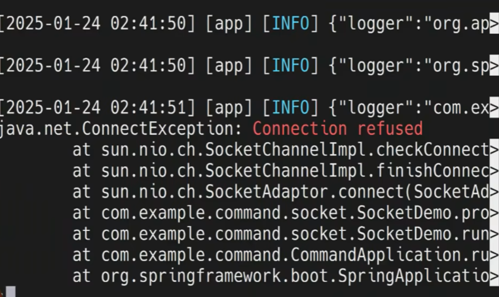
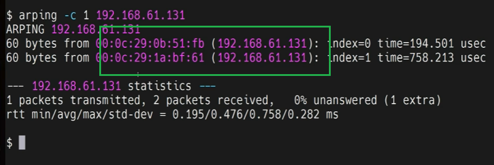

在计算机网络的 TCP 协议中，RST（Reset） 是 TCP 首部的 6 个标志比特之一，用于表示 “重置连接”。当通信双方的 TCP 连接出现异常时，一方会向另一方发送带有 RST 标志的数据包，以终止当前连接并尝试重新建立正常连接。

端口不可达：若发送方尝试连接一个不存在或未启用的端口，接收方会返回 RST 包，告知端口无法通信（如Connection refused，即服务端端口未监听，会返回 RST 包）。

定位结果

### 问题总结与解决思路  
- **问题总结**：同一内网中两台设备配置了相同 IP，导致 ARP 响应冲突，影响网络通信。因 ARP 缓存的存在，问题仅在缓存过期后主动查询时偶发。  
- **解决思路**：  
  1. **检查 IP 配置**：逐一核查设备 IP 地址，确保唯一性。  
  2. **静态 ARP 绑定**：在关键设备（如网关）上通过 `arp -s IP MAC` 绑定正确的 IP-MAC 关系，避免被错误响应干扰。   

### 一、ARP 协议简介  
ARP（Address Resolution Protocol，地址解析协议）是 TCP/IP 协议族中的重要协议，用于将 **IP 地址解析为 MAC 地址**，实现局域网内设备间的通信。当设备需向目标 IP 发送数据时，先通过 ARP 查找其 MAC 地址，若 ARP 缓存中无记录，则发起 ARP 广播请求。  

---

### 二、“arping 发现两个 MAC 地址对应同一 IP”的情况  
使用 `arping -c 1 192.168.61.131` 时，若两台服务器返回不同 MAC 地址，说明它们配置了**相同的内网 IP**，这会导致 **IP 地址冲突**。可能原因包括：  
- 手动配置 IP 时重复分配。  
- 网络中存在 ARP 攻击（如恶意程序伪造 MAC 地址响应 ARP 请求）。  
此冲突会破坏网络通信的正常性，如数据包发送混乱、部分设备无法联网。  

---

### 三、ARP 主动查询与被动学习  
1. **主动查询**  
   设备主动发送 ARP 广播请求（如 `arping` 命令），询问特定 IP 对应的 MAC 地址。广播包中包含**发送方自身的 IP 和 MAC 地址**，目标 IP 所有者会返回单播响应，告知自己的 MAC 地址。  
2. **被动学习**  
   设备接收网络中其他设备的 ARP 报文（请求或响应）时，从中提取 IP-MAC 对应关系并更新到自己的 ARP 缓存中。例如，设备 A 收到设备 B 的 ARP 响应，会记录“B 的 IP → B 的 MAC”。  

---

### 四、ARP 缓存及其过期机制  
- **ARP 缓存**：设备存储 IP-MAC 映射的临时表，避免每次通信都发起 ARP 广播。  
- **缓存过期**：缓存条目有生存时间（如几分钟），过期后自动删除。此时若需通信，需重新发起 ARP 查询。  
- **主动查询与活跃服务器的关系**：当 ARP 缓存过期后，设备发起主动查询。活跃的服务器因网络状态好、资源占用低，响应更快，易被其他设备优先接收并记录。但因缓存存在，不会每次都查询，故 IP 冲突问题**偶发**而非频繁出现。  

---

| 知识点 | 描述 |
| ---- | ---- |
| arp协议 | 查询局域网中IP对应的MAC地址 |
| IP地址冲突 | 同局域网中，两台机器配置了一样的IP，可通过arping命令检测是否冲突 |
| arp缓存 | 2种更新方式 1. 缓存过期触发arp主动查询，查询结果更新到arp缓存中。 2. 被动学习局域网上其它机器的arp广播，将其发送方信息(IP与MAC)更新到arp缓存中。 | 