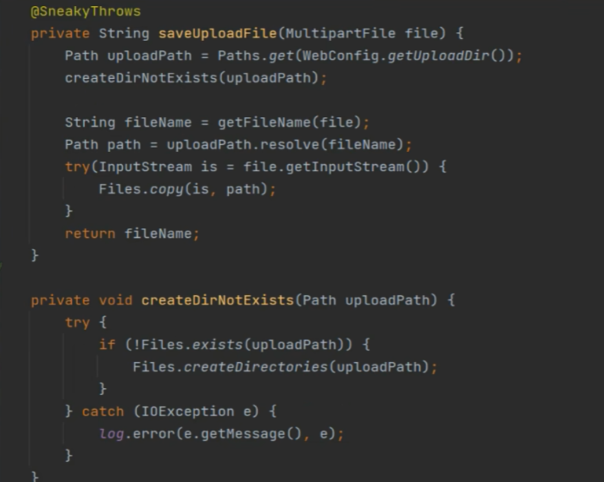

### 1. 抛出异常是否影响后续代码执行的问题  
在 Java 中，若异常被 `catch` 块捕获并处理，程序会继续执行 `catch` 块之后的代码，**不会中断**。例如在 `createDirNotExists` 方法中，`IOException` 被捕获后仅记录日志，不会影响 `saveUploadFile` 方法后续逻辑（如文件复制、返回文件名）。但若异常未被捕获（即未处理的受检异常或运行时异常），程序才会中断执行。

### 2. catch 语句后是否抛出 `IOException`？  
是否在 `catch` 中重新抛出 `IOException` 取决于需求：  
- 若希望上层调用者处理该异常，可在 `catch` 中 `throw new IOException(e)`，将异常向上传递。  
- 若仅需记录日志（如原代码），则无需抛出。但业务中通常不会直接抛 `IOException`，而是转为更易理解的业务异常（见第 5 点）。

### 3. Lombok 的 `@SneakyThrows`  
`@SneakyThrows` 是 Lombok 的注解，用于简化受检异常处理：  
- 当方法可能抛出受检异常（如 `IOException`）时，无需显式写 `try-catch` 或在方法声明中 `throws`，Lombok 会自动生成隐含的 `try-catch`，并将受检异常包装为 `RuntimeException` 抛出。  
- 示例：  
  ```java
  @SneakyThrows
  private void createDirNotExists(Path uploadPath) {
      if (!Files.exists(uploadPath)) {
          Files.createDirectories(uploadPath);
      }
  }
  ```  
  此时代码无需显式处理 `IOException`，但会将其转为运行时异常，调用方可能忽略异常处理，需谨慎使用。

### 4. 受检异常的 `catch` 处理  
受检异常（如 `IOException`）必须显式处理（`try-catch`）或声明抛出（`throws`）。在 `catch` 中：  
- 可记录日志、执行恢复逻辑（如重试）。  
- 也可重新抛出异常（`throw e`），但通常会对异常做进一步封装，避免直接暴露底层技术细节。

### 5. 业务中抛出自定义 `BusinessException`  
在业务场景中，为统一异常处理并隐藏技术细节，常将受检异常转为自定义业务异常。例如：  
```java
catch (IOException e) {
    log.error("文件上传目录创建失败", e);
    throw new BusinessException("文件上传失败，请联系管理员"); // 自定义业务异常
}
```  
这样上层业务代码只需捕获 `BusinessException`，便于集中处理（如返回统一错误响应），提升代码可读性和可维护性。  