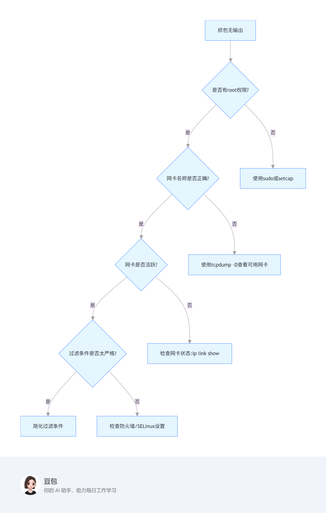

### **一、TCPDump基础入门**
#### **1.1 工具定位与环境搭建**

##### **理论讲解（10-15分钟）**
1. **核心功能认知（5分钟）**  
   - **网络诊断**：实时捕获网络数据包，定位丢包、延迟、连接拒绝等问题  
   - **协议逆向**：分析未知协议格式（如私有API通信）  
   - **性能调优**：监控带宽使用、识别流量热点、优化TCP参数  

   **案例**：  
   - 某电商网站响应缓慢，通过tcpdump发现数据库查询包异常大  
   - 某服务器无法访问外网，抓包发现防火墙拦截了ACK响应  

2. **多平台安装（3分钟）**  
   - **Ubuntu/Debian**：`sudo apt-get install tcpdump`  
   - **CentOS/RHEL**：`sudo yum install tcpdump`  
   - **macOS**：`brew install tcpdump`（需先安装Homebrew）  
   - **Windows**：通过WSL（Windows Subsystem for Linux）运行  

3. **权限配置（5分钟）**  
   - **root权限**：直接使用`sudo tcpdump`  
   - **CAP_NET_RAW能力**：  
     ```bash
     # 允许普通用户使用tcpdump（需root权限）
     sudo setcap cap_net_raw,cap_net_admin=eip /usr/sbin/tcpdump
     ```
   - **SELinux/Firewalld**：  
     ```bash
     # 临时允许tcpdump（CentOS/RHEL）
     sudo setsebool -P nis_enabled 1
     ```


##### **实操演示（15-20分钟）**
1. **安装验证（5分钟）**  
   ```bash
   # 检查版本
   tcpdump --version
   
   # 列出可用网卡（需root权限）
   sudo tcpdump -D
   ```

2. **基础抓包操作（10分钟）**  
   ```bash
   # 捕获eth0接口的前10个数据包（显示简略信息）
   sudo tcpdump -i eth0 -c 10
   
   # 捕获并显示ASCII内容（HTTP请求）
   sudo tcpdump -i eth0 -A -s 0 'tcp port 80'
   
   # 禁用DNS解析（避免卡顿）
   sudo tcpdump -i eth0 -n -c 5
   ```

3. **权限验证（5分钟）**  
   ```bash
   # 普通用户尝试抓包（无权限时会报错）
   tcpdump -i eth0 -c 1
   
   # 赋予权限后重试（需先执行setcap命令）
   tcpdump -i eth0 -c 1
   ```


##### **独立练习（20-30分钟）**
1. **环境搭建（10分钟）**  
   - 在Ubuntu/CentOS/macOS中安装tcpdump  
   - 配置普通用户权限（使用setcap或sudo）  
   - **验证方法**：  
     ```bash
     # 检查tcpdump路径
     which tcpdump
     
     # 检查文件能力
     getcap /usr/sbin/tcpdump
     ```

2. **基础抓包（15分钟）**  
   - 捕获本地环回接口（lo）的数据包  
   - 过滤TCP协议且端口为22（SSH）的流量  
   - **验证方法**：  
     ```bash
     # 启动SSH服务（本地测试）
     sudo service ssh start
     
     # 另开终端连接SSH
     ssh localhost
     
     # 抓包验证（应有SYN/ACK包）
     sudo tcpdump -i lo 'tcp port 22'
     ```

3. **权限挑战（5分钟）**  
   - 创建专用用户`tcpuser`，配置仅能使用tcpdump的权限  
   - **验证方法**：  
     ```bash
     # 创建用户
     sudo useradd tcpuser
     
     # 切换用户测试
     sudo -u tcpuser tcpdump -i eth0 -c 1
     ```


##### **常见问题解答（5-10分钟）**
1. **权限错误**：  
   - Q：`tcpdump: eth0: You don't have permission to capture on that device`  
   - A：使用`sudo`或配置CAP_NET_RAW能力  

2. **无输出结果**：  
   - Q：执行命令后无数据包显示  
   - A：  
     - 检查网卡名称是否正确（`tcpdump -D`）  
     - 尝试其他接口（如`lo`或`enp0s3`）  
     - 确认网络活动（ping外网或启动服务）  

3. **版本兼容性**：  
   - Q：某些参数（如`-G`）在旧版本中不支持  
   - A：升级tcpdump到最新版本（`apt-get update && apt-get upgrade`）  

4. **SELinux/Firewalld拦截**：  
   - Q：CentOS中无法捕获特定端口流量  
   - A：  
     ```bash
     # 临时关闭SELinux
     sudo setenforce 0
     
     # 开放防火墙端口
     sudo firewall-cmd --add-port=80/tcp --permanent
     sudo firewall-cmd --reload
     ```


### **教学资源**
1. **参考命令速查表**：  
   ```markdown
   | 功能               | 命令示例                          |
   |--------------------|-----------------------------------|
   | 列出网卡           | `tcpdump -D`                     |
   | 捕获指定接口       | `tcpdump -i eth0`                |
   | 禁用DNS解析        | `tcpdump -n`                     |
   | 限制数据包数量     | `tcpdump -c 10`                  |
   | 显示ASCII内容      | `tcpdump -A`                     |
   | 保存到文件         | `tcpdump -w capture.pcap`        |
   ```

2. **验证脚本**：  
   ```bash
   # 自动检查环境配置
   if [ -x "$(command -v tcpdump)" ]; then
       echo "✓ tcpdump已安装"
   else
       echo "✗ tcpdump未安装"
   fi
   
   if getcap /usr/sbin/tcpdump | grep -q "cap_net_raw"; then
       echo "✓ 权限配置正确"
   else
       echo "✗ 需配置CAP_NET_RAW能力"
   fi
   ```

3. **排错流程图**：  
 


通过此设计，学员将掌握tcpdump的安装、权限配置与基础操作，能够独立验证环境并捕获简单流量。后续章节可在此基础上逐步引入过滤规则与协议分析。